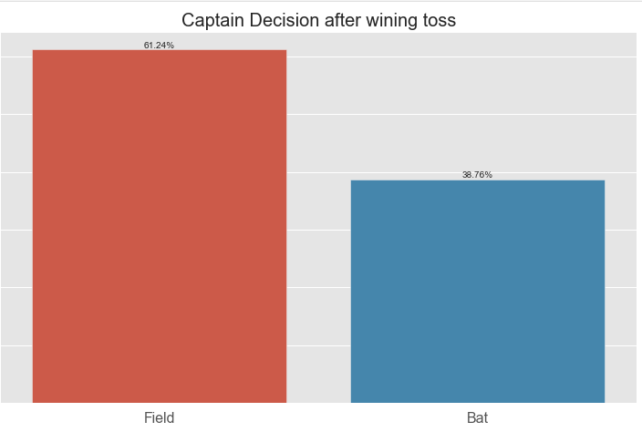
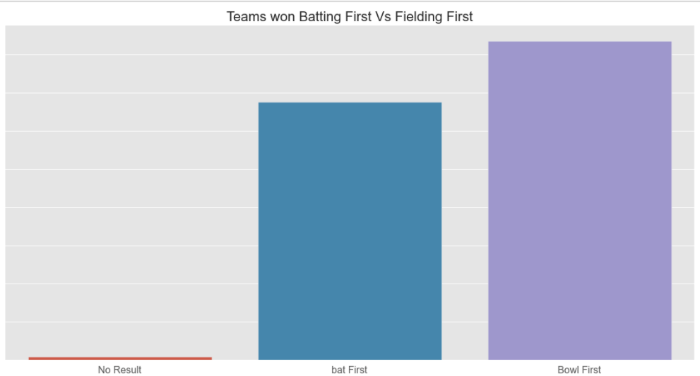
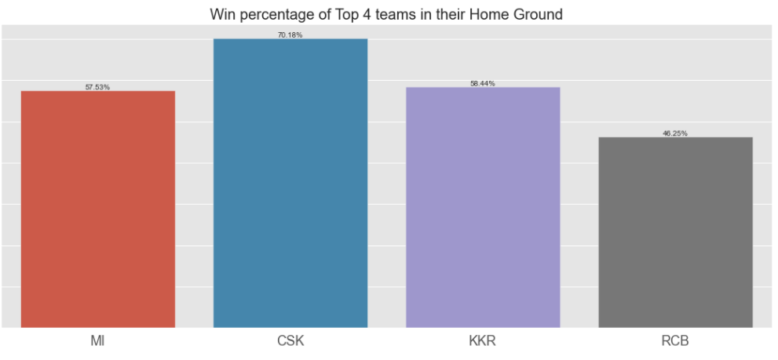
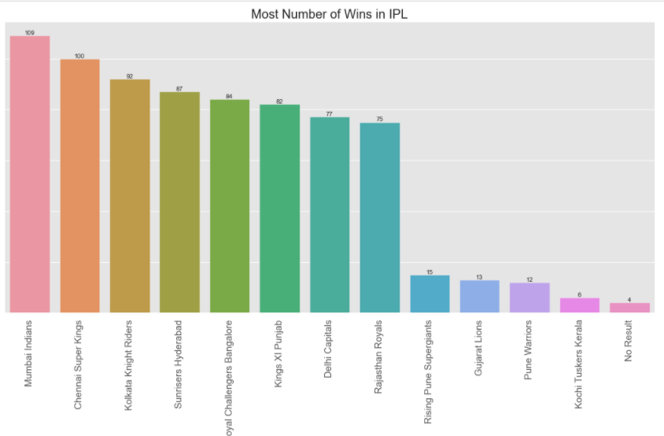
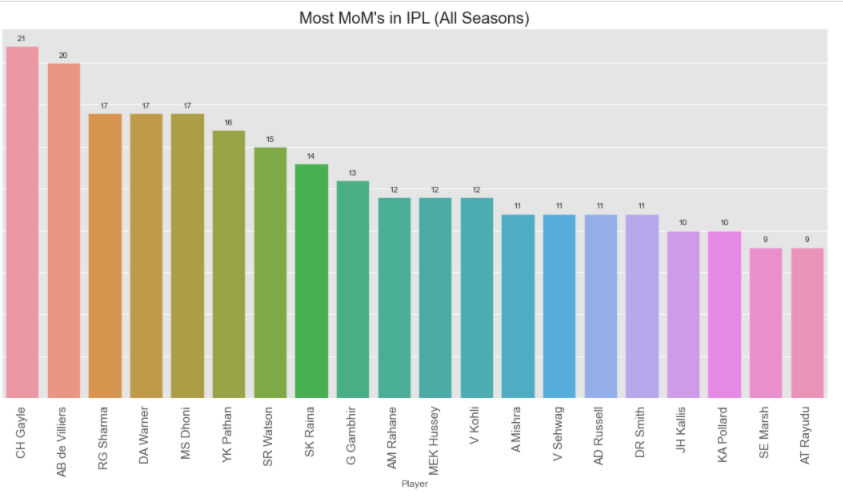
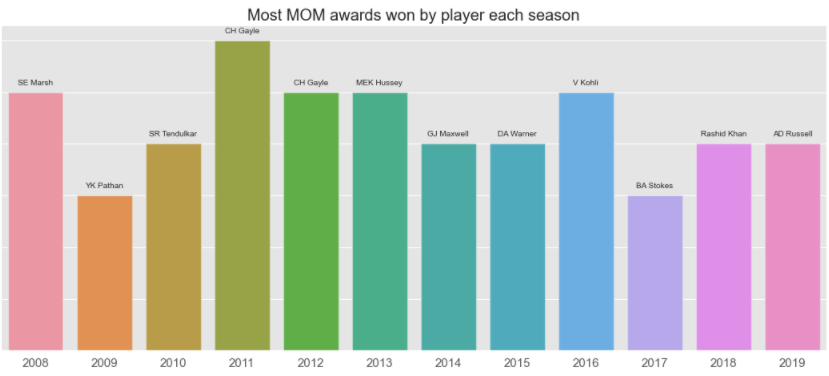
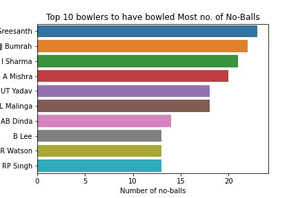

# IPL-Analysis

### This repo has two data files matches.csv and deliveries.csv. Matches.csv have match by match data and Delivieries.csv have ball by ball data of each match.
### So far i have done some data cleaning on Matches.csv and tried to draw some meaningful insights from it.
### Some of them are:

# Future Work:
### So far i have analysed only matches.csv.You can start contributing by doing some interesting analysis on "deliveries.csv" or analyse more "matches.csv" 

# Contributors: 

